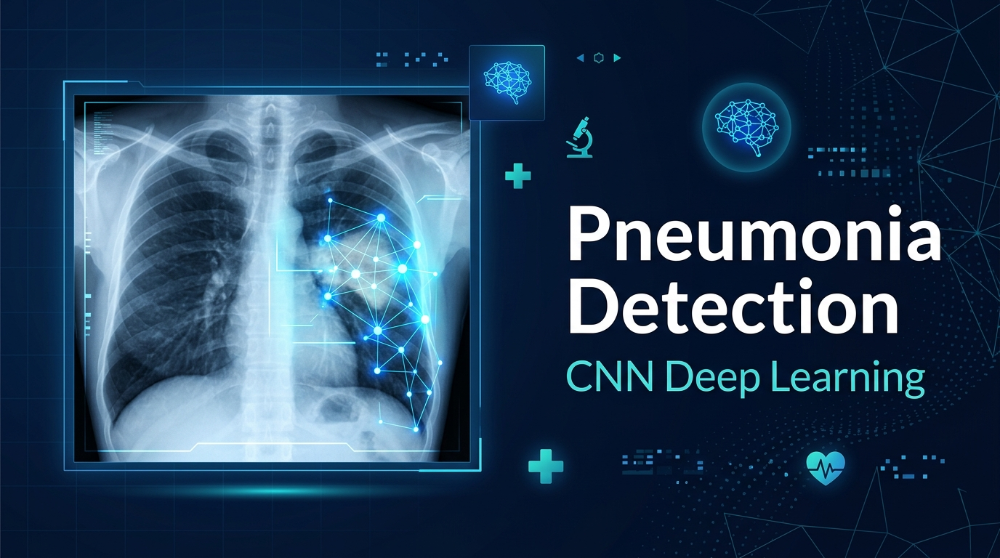
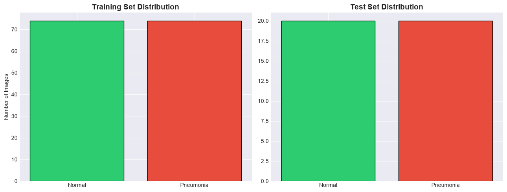
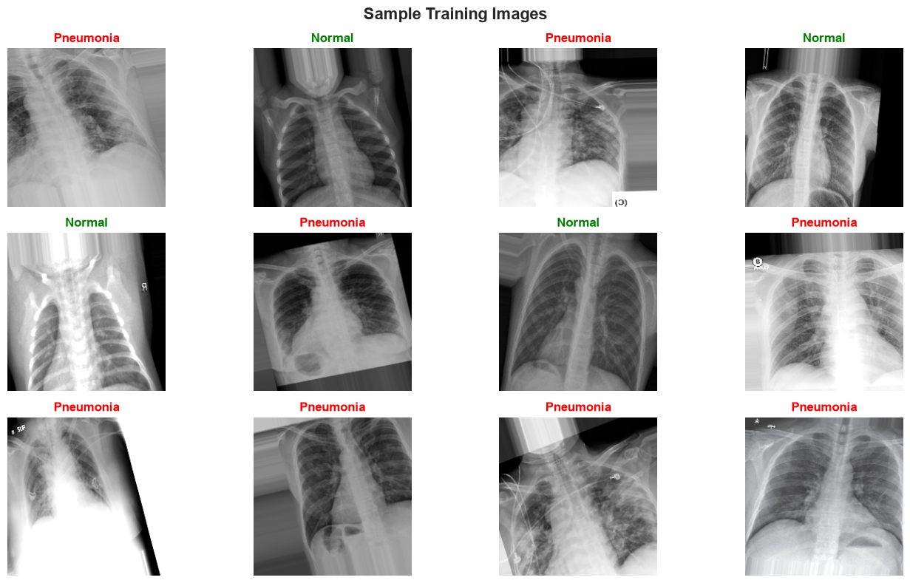
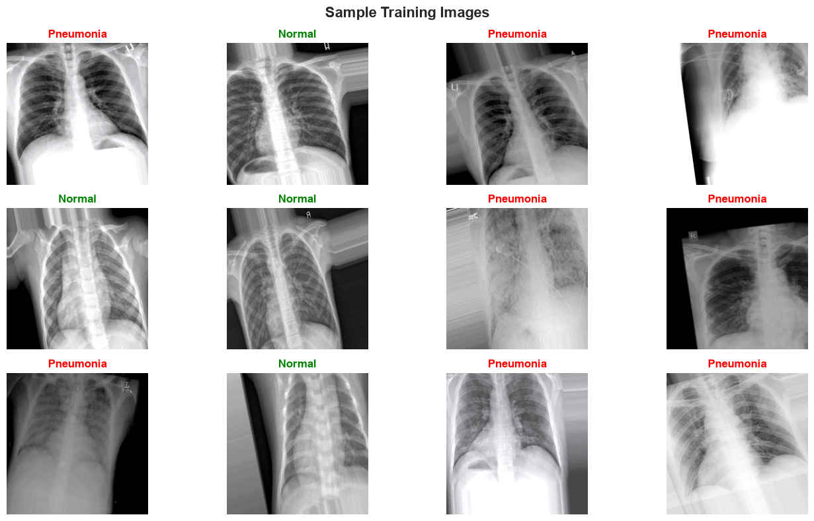
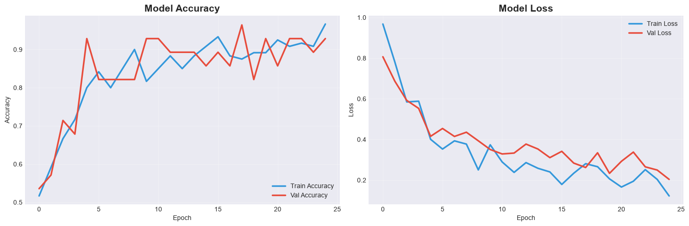
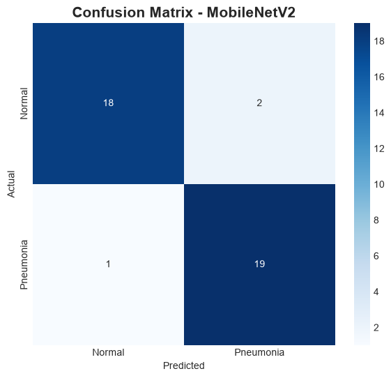
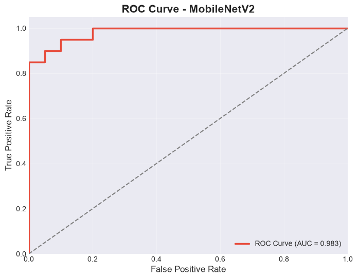
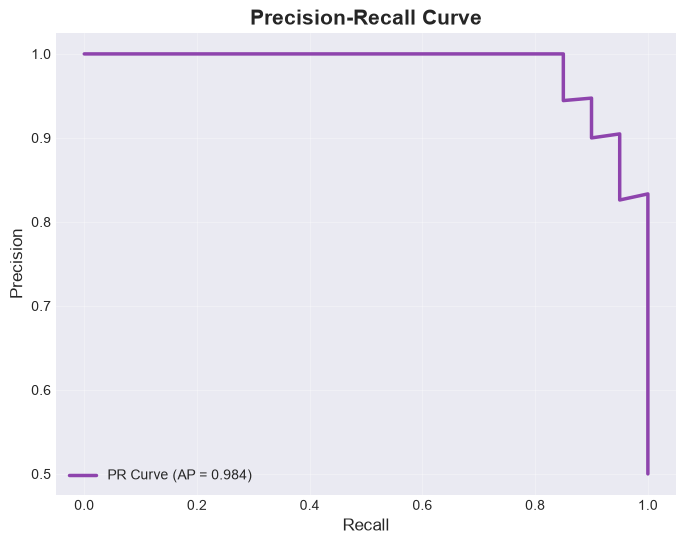
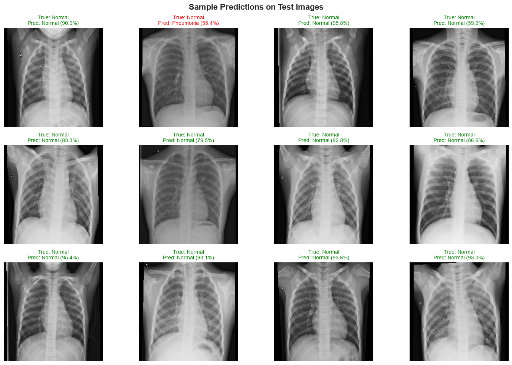
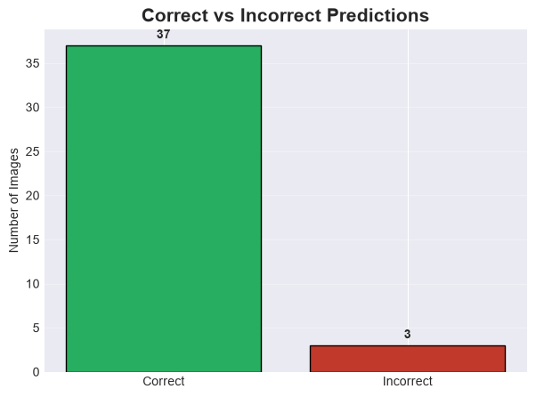

<div align="center">

# 🫁 Pneumonia X-Ray Detection using CNN (MobileNetV2)

### 🩺 Deep Learning-Powered Chest X-Ray Classification for Pneumonia Diagnosis

[](https://python.org)
[](https://tensorflow.org)
[](https://keras.io)
[](https://arxiv.org/abs/1801.04381)
[](LICENSE)
[]()

<br/>

<br/>

> **🎓 Built as part of AI/ML Technical Training — Exploring Transfer Learning, Data Augmentation & Medical Image Classification with Convolutional Neural Networks**

<br/>

| Metric | Value |
|:---|:---:|
| 🎯 **Test Accuracy** | **92.50%** |
| 📊 **Best Val Accuracy** | **96.43%** |
| 🧠 **Total Parameters** | **2.43M** |
| ⚡ **Trainable Parameters** | **166,657** |
| 📉 **Test Loss** | **0.1785** |

</div>

---

## 📋 Table of Contents

- [🔍 Overview](#-overview)
- [🏗️ Architecture](#️-architecture)
- [📊 Dataset](#-dataset)
- [🔧 Data Preprocessing & Augmentation](#-data-preprocessing--augmentation)
- [📈 Training Strategy](#-training-strategy)
- [🎯 Results & Performance](#-results--performance)
- [🖼️ Visualizations](#️-visualizations)
- [🛠️ Tech Stack](#️-tech-stack)
- [🚀 Getting Started](#-getting-started)
- [📂 Project Structure](#-project-structure)
- [🔮 Future Improvements](#-future-improvements)
- [🤝 Acknowledgments](#-acknowledgments)

---

## 🔍 Overview

Pneumonia is a serious lung infection that remains one of the **leading causes of death worldwide**, particularly among children and the elderly. Early and accurate diagnosis through chest X-ray analysis is crucial for effective treatment.

This project implements a **deep learning solution** using **Transfer Learning with MobileNetV2** to automatically classify chest X-ray images as either **Normal** or **Pneumonia**, achieving a remarkable **92.50% test accuracy** with an optimized lightweight architecture.

### 💡 Key Highlights

- 🏥 **Medical AI Application** — Real-world healthcare use case for automated diagnosis
- 🔄 **Transfer Learning** — Leveraging ImageNet-pretrained MobileNetV2 as feature extractor
- 📊 **Data Augmentation** — Comprehensive augmentation pipeline to combat overfitting
- ⚡ **Lightweight Architecture** — Only **166K trainable parameters** (out of 2.43M total)
- 📈 **Smart Training** — EarlyStopping, ReduceLROnPlateau, and ModelCheckpoint callbacks
- 🎯 **High Precision** — 95% precision for Normal, 90% for Pneumonia detection

---

## 🏗️ Architecture

The model uses a **Sequential architecture** with **MobileNetV2** as the backbone feature extractor:

```
┌─────────────────────────────────────────────────────────────────┐
│                    INPUT: 224 × 224 × 3                         │
├─────────────────────────────────────────────────────────────────┤
│                                                                 │
│  ┌───────────────────────────────────────────────────────────┐  │
│  │       MobileNetV2 (ImageNet Pre-trained, Frozen)          │  │
│  │       Output: 7 × 7 × 1280                               │  │
│  │       Parameters: 2,257,984 (Non-trainable)               │  │
│  └───────────────────────────────────────────────────────────┘  │
│                            ↓                                    │
│  ┌───────────────────────────────────────────────────────────┐  │
│  │              GlobalAveragePooling2D                        │  │
│  │              Output: 1280                                  │  │
│  └───────────────────────────────────────────────────────────┘  │
│                            ↓                                    │
│  ┌───────────────────────────────────────────────────────────┐  │
│  │              BatchNormalization                            │  │
│  │              Output: 1280                                  │  │
│  └───────────────────────────────────────────────────────────┘  │
│                            ↓                                    │
│  ┌───────────────────────────────────────────────────────────┐  │
│  │              Dense (128, ReLU)                             │  │
│  │              Parameters: 163,968                           │  │
│  └───────────────────────────────────────────────────────────┘  │
│                            ↓                                    │
│  ┌───────────────────────────────────────────────────────────┐  │
│  │              Dropout (0.4)                                 │  │
│  │              Regularization Layer                          │  │
│  └───────────────────────────────────────────────────────────┘  │
│                            ↓                                    │
│  ┌───────────────────────────────────────────────────────────┐  │
│  │              Dense (1, Sigmoid)                            │  │
│  │              Binary Classification Output                  │  │
│  └───────────────────────────────────────────────────────────┘  │
│                                                                 │
├─────────────────────────────────────────────────────────────────┤
│              OUTPUT: Normal (0) / Pneumonia (1)                 │
└─────────────────────────────────────────────────────────────────┘
```

### 📊 Model Summary

| Layer | Output Shape | Parameters |
|:---|:---:|---:|
| MobileNetV2 (Functional) | (None, 7, 7, 1280) | 2,257,984 |
| GlobalAveragePooling2D | (None, 1280) | 0 |
| BatchNormalization | (None, 1280) | 5,120 |
| Dense (ReLU) | (None, 128) | 163,968 |
| Dropout (0.4) | (None, 128) | 0 |
| Dense (Sigmoid) | (None, 1) | 129 |
| **Total** | | **2,427,201** |
| **Trainable** | | **166,657** |
| **Non-trainable** | | **2,260,544** |

---

## 📊 Dataset

The project uses a **COVID-19 Chest X-Ray dataset** with binary classification:

| Split | Images | Classes |
|:---|:---:|:---:|
| 🏋️ **Training** | 120 | Normal, Pneumonia |
| ✅ **Validation** | 28 | Normal, Pneumonia |
| 🧪 **Test** | 40 | Normal, Pneumonia |

> 📁 **Dataset Source:** [Kaggle - COVID-19 X-Ray Dataset](https://www.kaggle.com/datasets)
> 
> The dataset contains curated chest X-ray images organized into `NORMAL` and `PNEUMONIA` directories.

---

## 🔧 Data Preprocessing & Augmentation

A robust **data augmentation pipeline** was implemented to increase model generalization and prevent overfitting on the limited dataset:

```python
train_datagen = ImageDataGenerator(
    rescale=1./255,              # ✅ Pixel Normalization [0, 1]
    rotation_range=20,           # 🔄 Random rotation ±20°
    width_shift_range=0.2,       # ↔️ Horizontal shift ±20%
    height_shift_range=0.2,      # ↕️ Vertical shift ±20%
    shear_range=0.15,            # 📐 Shear transformation
    zoom_range=0.2,              # 🔍 Random zoom ±20%
    horizontal_flip=True,        # 🪞 Horizontal mirroring
    brightness_range=[0.7, 1.3], # 💡 Brightness variation
    fill_mode='nearest',         # 🎨 Fill strategy
    validation_split=0.2         # 📊 80/20 train-val split
)
```

### 🖼️ Image Configuration
- **Input Size:** `224 × 224` pixels (MobileNetV2 standard)
- **Batch Size:** `16`
- **Color Mode:** RGB (3 channels)
- **Class Mode:** Binary

---

## 📈 Training Strategy

### ⚙️ Optimizer & Loss
| Component | Configuration |
|:---|:---|
| **Optimizer** | Adam |
| **Initial Learning Rate** | 0.0001 |
| **Loss Function** | Binary Crossentropy |
| **Metrics** | Accuracy |

### 🎛️ Training Callbacks

| Callback | Purpose | Configuration |
|:---|:---|:---|
| ⏹️ **EarlyStopping** | Prevent overfitting | `patience=8`, `restore_best_weights=True` |
| 📉 **ReduceLROnPlateau** | Adaptive learning rate | `factor=0.3`, `patience=3`, `min_lr=1e-7` |
| 💾 **ModelCheckpoint** | Save best model | Monitor `val_accuracy`, `save_best_only=True` |

### 📉 Learning Rate Schedule

| Epoch | Learning Rate | Event |
|:---|:---:|:---|
| 1–16 | `1.0e-04` | Initial learning rate |
| 17 | `3.0e-05` | ReduceLROnPlateau triggered |
| 23 | `9.0e-06` | ReduceLROnPlateau triggered again |

> 🏆 **Best model weights restored from Epoch 20** with `val_accuracy = 96.43%`

---

## 🎯 Results & Performance

### ✅ Test Set Evaluation

<div align="center">

| Metric | Score |
|:---|:---:|
| 🎯 **Test Accuracy** | **92.50%** |
| 📉 **Test Loss** | **0.1785** |

</div>

### 📊 Classification Report

| Class | Precision | Recall | F1-Score | Support |
|:---|:---:|:---:|:---:|:---:|
| 🟢 **Normal** | 0.95 | 0.90 | 0.92 | 20 |
| 🔴 **Pneumonia** | 0.90 | 0.95 | 0.93 | 20 |
| **Macro Average** | 0.93 | 0.93 | 0.92 | 40 |
| **Weighted Average** | 0.93 | 0.93 | 0.92 | 40 |

### 🔢 Confusion Matrix Breakdown

```
                    Predicted Normal    Predicted Pneumonia
┌──────────────────┬────────────────────┬─────────────────────┐
│ Actual Normal     │       18 (TN) ✅   │        2 (FP) ❌    │
├──────────────────┼────────────────────┼─────────────────────┤
│ Actual Pneumonia  │        1 (FN) ❌   │       19 (TP) ✅    │
└──────────────────┴────────────────────┴─────────────────────┘
```

- ✅ **True Negatives (Correct Normal):** 18 / 20 = 90%
- ✅ **True Positives (Correct Pneumonia):** 19 / 20 = 95%
- ❌ **False Positives (Normal → Pneumonia):** 2
- ❌ **False Negatives (Pneumonia → Normal):** 1

> 💡 **Clinical Insight:** The model shows **higher recall for Pneumonia (95%)**, which is critical in medical applications — missing a pneumonia case (False Negative) is more dangerous than a false alarm.

---

## 🖼️ Visualizations

### 📊 Class Distribution
<div align="center">

</div>

---

### 🩻 Sample Data (Augmented X-Ray Images)
<div align="center">

<br/>

</div>

---

### 📈 Training History — Accuracy & Loss
<div align="center">

</div>

> The plots show the model's **training and validation accuracy/loss** across 25 epochs. The training accuracy steadily climbs to ~96% while validation accuracy peaks at ~96.43% (Epoch 20). The loss curves demonstrate healthy convergence with no severe overfitting.

---

### 🔢 Confusion Matrix — Test Set Performance
<div align="center">

</div>

> The confusion matrix reveals strong classification performance with only **3 misclassifications out of 40 test samples** — 2 false positives and 1 false negative, achieving a balanced and clinically reliable result.

---

### 🎯 ROC AUC & Precision-Recall Curves
<div align="center">


</div>

---

### 🔍 Sample Model Predictions
<div align="center">

</div>

---

### 📝 Prediction Summary
<div align="center">

</div>

## 🛠️ Tech Stack

<div align="center">

| Technology | Purpose | Version |
|:---:|:---|:---:|
|  | Programming Language | 3.10+ |
|  | Deep Learning Framework | 2.21.0 |
|  | High-Level Neural Network API | Built-in |
|  | Numerical Computing | 1.24+ |
|  | Visualization | 3.7+ |
|  | Statistical Visualization | 0.12+ |
|  | Metrics & Evaluation | 1.3+ |

</div>

---

## 🚀 Getting Started

### Prerequisites

- Python 3.10 or higher
- pip package manager

### Installation

```bash
# 1️⃣ Clone the repository
git clone https://github.com/balamuruganpg/Pneumonia-Xray-CNN-Detection.git
cd Pneumonia-Xray-CNN-Detection

# 2️⃣ Create a virtual environment (recommended)
python -m venv venv
source venv/bin/activate        # Linux/Mac
# venv\Scripts\activate         # Windows

# 3️⃣ Install dependencies
pip install -r requirements.txt

# 4️⃣ Launch Jupyter Notebook
jupyter notebook Pneumonia-Xray-CNN-Detection.ipynb
```

### 📁 Dataset Setup

Download the chest X-ray dataset and organize it as:

```
xray_dataset_covid19/
├── train/
│   ├── NORMAL/
│   └── PNEUMONIA/
└── test/
    ├── NORMAL/
    └── PNEUMONIA/
```

---

## 📂 Project Structure

```
Pneumonia-Xray-CNN-Detection/
│
├── 📓 Pneumonia-Xray-CNN-Detection.ipynb   # Main notebook with complete pipeline
├── 🧠 pneumonia_mobilenetv2_final.keras     # Trained model weights
├── 📋 requirements.txt                      # Python dependencies
├── 📖 README.md                             # Project documentation
├── 🚫 .gitignore                            # Git ignore rules
│
└── 📁 assets/                               # Visualization outputs
    ├── 🖼️ project_banner.jpg               # AI Banner Image
    ├── 📊 class_distribution.png           # Dataset Distribution
    ├── 🩻 sample_xray_images.png           # X-Ray Data Samples
    ├── 📈 training_history.png             # Accuracy & Loss Curves
    ├── 🔢 confusion_matrix.png             # Confusion Matrix
    ├── 🎯 roc_auc_curve.png                # ROC AUC Curve
    ├── 🔍 sample_predictions.png           # Actual Model Predictions
    └── 📝 prediction_summary.png           # Correct/Incorrect Summary
```

---

## 🔮 Future Improvements

- [ ] 🔓 **Fine-tuning** — Unfreeze top layers of MobileNetV2 for further accuracy gains
- [ ] 📊 **Larger Dataset** — Train on full-scale chest X-ray datasets (e.g., ChestX-ray14)
- [ ] 🏗️ **Multi-class Classification** — Extend to detect COVID-19, bacterial vs viral pneumonia
- [ ] 📈 **ROC-AUC Analysis** — Add ROC curve and AUC score visualization
- [ ] 🔍 **Grad-CAM Visualization** — Highlight regions influencing model decisions
- [ ] 🌐 **Web Deployment** — Build Flask/Streamlit app for real-time X-ray classification
- [ ] 📱 **Mobile Deployment** — Convert to TFLite for edge device inference

---

## 📚 Key Learnings

This project reinforced several critical **AI/ML concepts** during technical training:

| Concept | Application |
|:---|:---|
| 🔄 **Transfer Learning** | Leveraging pre-trained MobileNetV2 features for medical imaging |
| 🧊 **Feature Extraction** | Freezing base model weights, training only custom classifier |
| 📊 **Data Augmentation** | Combating limited data with geometric & photometric transforms |
| 📉 **Learning Rate Scheduling** | ReduceLROnPlateau for adaptive optimization |
| ⏹️ **Early Stopping** | Preventing overfitting with patience-based training termination |
| 📐 **Binary Classification** | Sigmoid activation with binary crossentropy loss |
| 🏥 **Medical AI Ethics** | Understanding precision/recall trade-offs in healthcare |

---

## 🤝 Acknowledgments

- **MobileNetV2 Paper:** Sandler et al., *"MobileNetV2: Inverted Residuals and Linear Bottlenecks"* (2018)
- **Dataset:** COVID-19 Chest X-Ray Dataset from Kaggle
- **Framework:** TensorFlow & Keras teams for the deep learning ecosystem
- **Training:** Part of AI/ML Technical Training curriculum

---

<div align="center">

### ⭐ If you found this project helpful, please consider giving it a star!

<br/>

**Built with ❤️ by [BALAMURUGAN P G](https://github.com/balamuruganpg) | AI/ML Technical Training**

<br/>

[](https://github.com/balamuruganpg)

</div>
